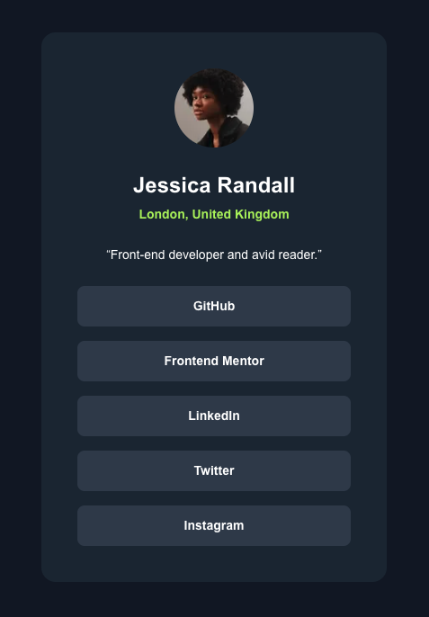

# Frontend Mentor - Social links profile solution

This is a solution to the [Social links profile challenge on Frontend Mentor](https://www.frontendmentor.io/challenges/social-links-profile-UG32l9m6dQ). Frontend Mentor challenges help you improve your coding skills by building realistic projects.

## Table of contents

- [Overview](#overview)
  - [The challenge](#the-challenge)
  - [Screenshot](#screenshot)
  - [Links](#links)
- [My process](#my-process)
  - [Built with](#built-with)
  - [What I learned](#what-i-learned)
  - [Continued development](#continued-development)
  - [Useful resources](#useful-resources)
- [Author](#author)
- [Acknowledgments](#acknowledgments)

**Note: Delete this note and update the table of contents based on what sections you keep.**

## Overview

### The challenge

Users should be able to:

- See hover and focus states for all interactive elements on the page

### Screenshot



### Links

- Solution URL: [Frontend Mentor Solutions](https://www.frontendmentor.io/profile/BlonoBuccellati/solutions)
- Live Site URL: [Social Links Profile Deployed on Vercel](https://fm-social-links-profile-nine.vercel.app/)

## My process

### Built with

- Semantic HTML5 markup
- Flexbox
- Mobile-first workflow
- [React](https://reactjs.org/) - JS library
- [Next.js](https://nextjs.org/) - React framework
- [tailwindcss](https://tailwindcss.com/) - utility-first CSS framework

### What I learned

1. Figmaの読み方で、以下の内容を理解した。

- Fit: 枠からはみ出さすに収まるようにすること(`object-fit:contain`)
  ※可変な要素に指定すべき？
- Scale: 親要素に合わせる。(`width:100%`)
  ※`w-full`で解決

2. CSSについて、サイズの指定をどこまですべきか曖昧だったが、現在は以下の理解をしている。

- 親に合わせて動く場合:サイズを指定しない。
- サイズが決まっている場合:サイズを指定する。

そのため今回は、カードに対してサイズを指定し、他はボタンの`height`のみサイズを指定し、`width`を`full`に設定した。

```javascript
<div className="flex w-full flex-col gap-4">
  {links.map((button, index) => (
    <button
      key={index}
      className="h-[45px] w-full rounded-lg bg-gray-700 hover:cursor-pointer hover:bg-lime-300 hover:text-gray-700"
    >
      {/* some JSX */}
    </button>
  ))}
</div>
```

3. 行間について
   Tailwind を適用せずに、`line-height` を指定しないと、ブラウザのデフォルトの行間が適用されることを知った。
   デフォルトではブラウザごとに行間が異なるため、`leading-normal`(行間)を指定する必要があった。
   今までUIの微調整が出来ていなかったのは、行間が理解でいていなかったことだと思う。

### Continued development

mobile-firstの思想にのって、最も小さいサイズから指定すべきだったが、これが出来ていなかったため、次回からは最も小さいサイズから指定したいと思う。
Frontend Mentorの3回目の課題となったが、UIの構築にだいぶ慣れてきて、自信がついてきた。今後も継続的に学んでいきたい。また、現在GridではなくFlexboxを使用しているため、今後はGridにも慣れていきたい。

### Useful resources

- [【CSS】行間を指定するline-heightについて解説](https://kakuzaki-web.com/2024/06/179/#:~:text=%E9%81%A9%E7%94%A8%E3%81%95%E3%82%8C%E3%81%BE%E3%81%99%E3%80%82-,line%2Dheight%E3%81%AE%E3%83%87%E3%83%95%E3%82%A9%E3%83%AB%E3%83%88%E5%80%A4%E3%81%A8%E3%82%AB%E3%82%B9%E3%82%BF%E3%83%9E%E3%82%A4%E3%82%BA,%E3%81%99%E3%82%8B%E3%81%93%E3%81%A8%E3%81%8C%E9%87%8D%E8%A6%81%E3%81%A7%E3%81%99%E3%80%82) - 行間について知る上で役に立った。

## Author

- Website - [BlonoBuccellati](https://github.com/BlonoBuccellati)
- Frontend Mentor - [@BlonoBuccellati](https://www.frontendmentor.io/profile/BlonoBuccellati)
- zenn - [@bln](https://zenn.dev/bln)
