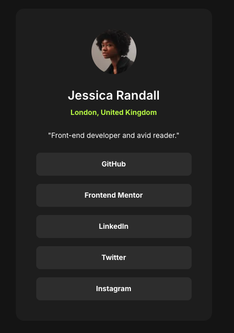

# Frontend Mentor - Social links profile solution

This is a solution to the [Social links profile challenge on Frontend Mentor](https://www.frontendmentor.io/challenges/social-links-profile-UG32l9m6dQ). Frontend Mentor challenges help you improve your coding skills by building realistic projects.

- [Frontend Mentor - Social links profile solution](#frontend-mentor---social-links-profile-solution)
  - [Overview](#overview)
    - [The challenge](#the-challenge)
    - [Screenshot](#screenshot)
    - [Links](#links)
  - [My process](#my-process)
    - [Built with](#built-with)
    - [What I learned](#what-i-learned)
    - [Continued development](#continued-development)
    - [Useful resources](#useful-resources)
  - [Author](#author)

## Overview

### The challenge

Users should be able to:

- See hover and focus states for all interactive elements on the page

### Screenshot



### Links

- Solution URL: [Frontend Mentor Solutions](https://www.frontendmentor.io/profile/BlonoBuccellati/solutions)
- Live Site URL: [Social Links Profile Deployed on Vercel](https://fm-social-links-profile-nine.vercel.app/)

## My process

### Built with

- Semantic HTML5 markup
- Flexbox
- Mobile-first workflow
- [React](https://reactjs.org/) - JS library
- [Next.js](https://nextjs.org/) - React framework
- [tailwindcss](https://tailwindcss.com/) - utility-first CSS framework

### What I learned

1. Understanding Figma Terminology

- Fit: Ensures that the content stays within the frame without overflowing(`object-fit: contain`).<br>
  ※ Might be necessary for elements with flexible sizes.
- Scale: Adjusts the size based on the parent element (`width: 100%`).<br>
  ※ Can be solved using `w-full`.

2. Clarifying CSS Size Specifications
   Previously, I was uncertain about how much to specify element sizes in CSS. Now, I understand the following principles:

- If an element should adjust based on its parent, do not specify a fixed size.
- If the size is predetermined, explicitly define it.

Based on this, I specified the size for the card, set a fixed `height` for the button, and applied `w-full` for its width.

```javascript
<div className="flex w-full flex-col gap-4">
  {links.map((button, index) => (
    <button
      key={index}
      className="h-[45px] w-full rounded-lg bg-gray-700 hover:cursor-pointer hover:bg-lime-300 hover:text-gray-700"
    >
      {/* some JSX */}
    </button>
  ))}
</div>
```

3. Understanding Line Height
   I learned that if Tailwind is not applied and `line-height` is not explicitly set, the browser's default line height is used.
   Since the default line height varies between browsers, it was necessary to specify `leading-normal` to ensure consistency.
   I now realize that my inability to fine-tune the UI before was due to my lack of understanding of line height.

### Continued development

Following the mobile-first approach, I should have started by defining styles for the smallest screen size first. However, I failed to do so this time. Moving forward, I will make sure to prioritize the smallest size first.
This was my third project on Frontend Mentor, and I feel much more comfortable with UI development, gaining confidence along the way. I want to continue learning consistently.
Currently, I am using Flexbox instead of Grid, so I plan to get more familiar with Grid in the future.

### Useful resources

- [【CSS】行間を指定するline-heightについて解説](https://kakuzaki-web.com/2024/06/179/#:~:text=%E9%81%A9%E7%94%A8%E3%81%95%E3%82%8C%E3%81%BE%E3%81%99%E3%80%82-,line%2Dheight%E3%81%AE%E3%83%87%E3%83%95%E3%82%A9%E3%83%AB%E3%83%88%E5%80%A4%E3%81%A8%E3%82%AB%E3%82%B9%E3%82%BF%E3%83%9E%E3%82%A4%E3%82%BA,%E3%81%99%E3%82%8B%E3%81%93%E3%81%A8%E3%81%8C%E9%87%8D%E8%A6%81%E3%81%A7%E3%81%99%E3%80%82) - It was helpful in deepening my understanding of line height.

## Author

- Website - [BlonoBuccellati](https://github.com/BlonoBuccellati)
- Frontend Mentor - [@BlonoBuccellati](https://www.frontendmentor.io/profile/BlonoBuccellati)
- zenn - [@bln](https://zenn.dev/bln)
